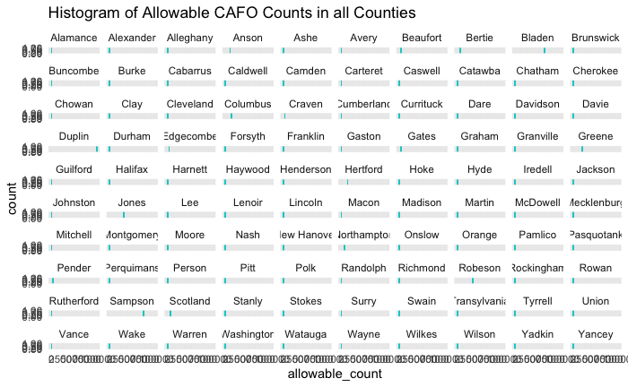
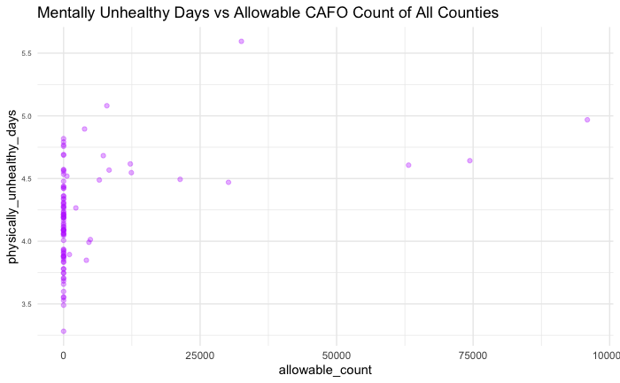

BIOS 611 - Project 1
--------------------

North Carolina County Health Rankings 2020 Data

### Introduction
Often we see health rankings on a national or even global scale, but not often on the state county scale; however, this does not make county health data any less important than the former two. Using a county health rankings dataset for the state of North Carolina, we can not only construct an overall summary of the health of the entire state, but compare certain county health rankings to each other as well.

Within this particular dataset, we have health data for counties ranging from Alamance to Yancey and measurements for variables ranging from mentally unhealthy days to long commutes driving alone. In analyzing this data, we can create a simple analysis of counts and determine which county ranks the best or worst in terms of a particular health variable. Additionally, we can also compare health variables to each other to determine if there is any correlation between certain measured data, such as if a poor air quality index also correlates with a poor food quality score.

My goal is to provide a general overview of each county's status on more unique variables, such as the aforementioned "driving alone/long commutes" measured data point, while also comparing more conventional health variables with each other to determine correlation.

#### Update 10/7/2020
I have changed the nature of this analysis by including another dataset. I plan on using this CAFO dataset in conjunction with the County Health dataset to determine whether the CAFOs in North Carolina have any influence or effect on different health related variables to communities in NC. I will use largely the same health variables from the County Health dataset:
* Average number of physically unhealthy days
* Average number of mentally unhealthy days
* Food Environment Index
* Average Daily PM2.5 (Air Quality)
* Life expectancy
* Percent frequent physical distress
* Percent frequent mental distress
* Percent poor or fair health

North Carolina is home to numerous concentrated animal feeding operations (CAFO). Previous studies have already shown that CAFOs can cause health effects in polluting air and water; CAFO waste is known to contain harmful chemicals such as methane, ammonia, and hydrogen sulfide.

Can we use previous recorded data on environmental quality (air, water) surrounding CAFOs in order to determine the overall general health of nearby communities in the future?

If there are significant issues to health caused by CAFOS, what steps can we take to address the health issues regarding CAFOs after identifying areas with the highest concentration of hogs?

### Data
The County Health dataset used in this analysis can be found on the County Health Rankings website, categorized by state and year. This particular dataset was derived from 2020 North Carolina health data.
https://www.countyhealthrankings.org/app/north-carolina/2020/overview

The CAFO data set used in this analysis records the number of allowable CAFO sites per county in North Carolina on a site by site basis; this particular dataset was recorded in 2019.
https://files.nc.gov/ncdeq/List_Of%20Permitted_Animal_Facilities2019-11-06.xls

### Preliminary Figures

### Running the Code
You'll need Docker and the ability to run Docker as your current user.
Build the container using:

    > docker build . -t project1

This Docker container is based on rocker/verse. To run the RStudio server:

    > docker run -v `pwd`:/home/rstudio -p 8787:8787\
      -e PASSWORD=cafocount -t project1
      
Then connect to port localhost:8787.

### Running RShiny
To run the interactive segments of this project, use the following two docker commands:
#### Allowable CAFO Count Histogram

    > docker run -p 8788:8788 \
         -v `pwd`:/home/rstudio \
         -e PASSWORD=cafocount \
         -it l17 sudo -H -u rstudio /bin/bash -c "cd ~/; PORT=8788 make cafoHistoExplore"

#### Allowable CAFO Count vs Health Variable Scatter Plot

    > docker run -p 8789:8789 \
         -v `pwd`:/home/rstudio \
         -e PASSWORD=cafocount \
         -it l17 sudo -H -u rstudio /bin/bash -c "cd ~/; PORT=8789 make scatterExplore"

