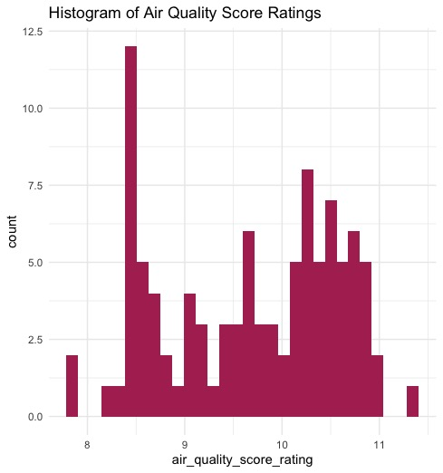
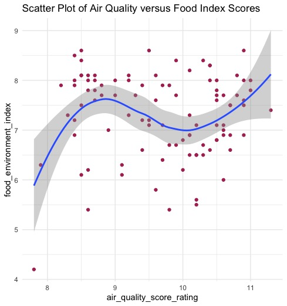
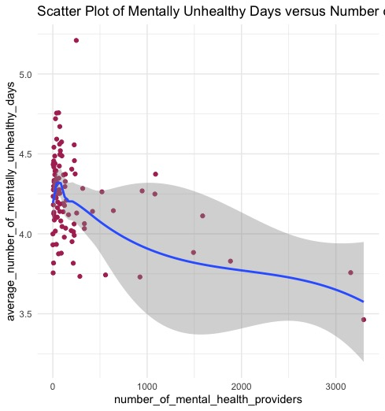

BIOS 611 - Project 1
--------------------

North Carolina County Health Rankings 2020 Data

#### Introduction
Often we see health rankings on a national or even global scale, but not often on the state county scale; however, this does not make county health data any less important than the former two. Using a county health rankings dataset for the state of North Carolina, we can not only construct an overall summary of the health of the entire state, but compare certain county health rankings to each other as well.

Within this particular dataset, we have health data for counties ranging from Alamance to Yancey and measurements for variables ranging from mentally unhealthy days to long commutes driving alone. In analyzing this data, we can create a simple analysis of counts and determine which county ranks the best or worst in terms of a particular health variable. Additionally, we can also compare health variables to each other to determine if there is any correlation between certain measured data, such as if a poor air quality index also correlates with a poor food quality score.

My goal is to provide a general overview of each county's status on more unique variables, such as the aforementioned "driving alone/long commutes" measured data point, while also comparing more conventional health variables with each other to determine correlation.

#### Data
The dataset used in this analysis can be found on the County Health Rankings website, categorized by state and year. This particular dataset was derived from 2020 North Carolina health data.

#### Preliminary Figures

