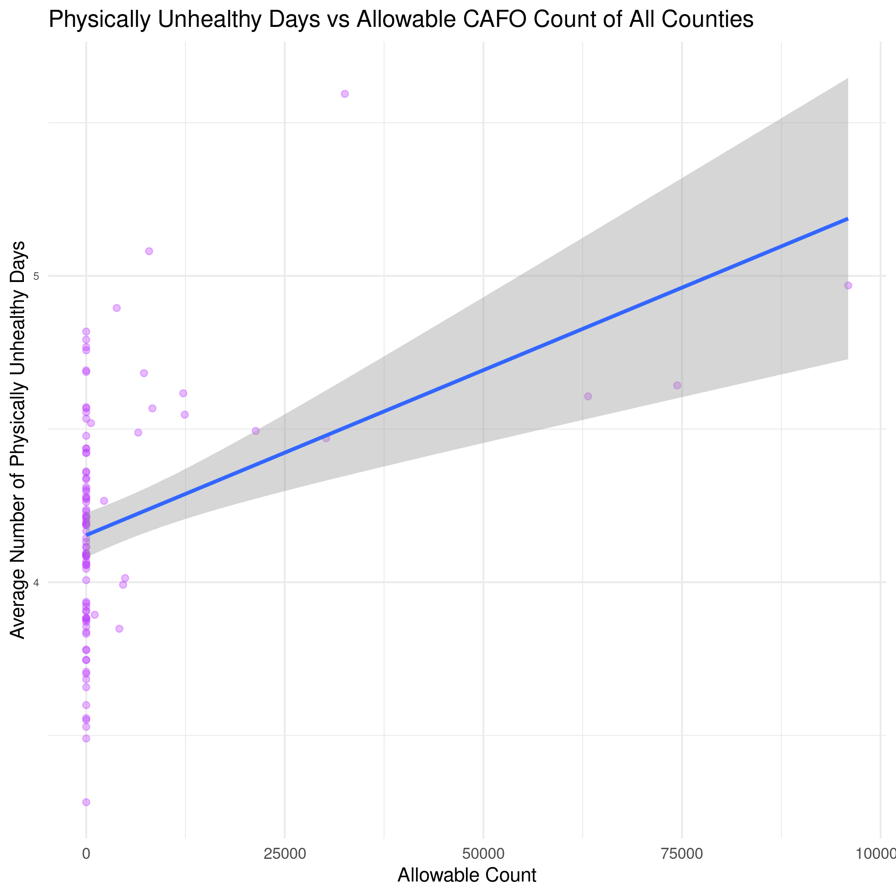

# Background

North Carolina is home to numerous concentrated animal feeding operations (CAFO). Previous studies have already shown that CAFOs can cause health effects in polluting air and water; CAFO waste is known to contain harmful chemicals such as methane, ammonia, and hydrogen sulfide.

How do CAFOs affect local community health? I want to focus on these specific health variables: average number of physically unhealthy days, average number of mentally unhealthy days, food environment index, average daily PM2.5 (air pollution), life expectancy, percent frequent physical distress, percent frequent mental distress, and percent poor or fair health.

Can we use previous recorded data on environmental quality (air, water) surrounding CAFOs in order to determine the overall general health of nearby communities in the future?

What steps can we take to address the health issues regarding CAFOs after identifying areas with the highest concentration of hogs?

# Approach
Using the CAFO Allowable Counts and North Carolina County Health datasets, I created several different plots and, when applicable, regression lines on said plots to determine if there were any discernable relationships or correlation between certain health variables and increased presence of concentrated animal feeding operations. I chose the following specific health variables to observe:
* Average number of physically unhealthy days
* Average number of mentally unhealthy days
* Food Environment Index
* Average Daily PM2.5 (Air Quality)
* Life expectancy
* Percent frequent physical distress
* Percent frequent mental distress
* Percent poor or fair health

In order to accomplish this, I cleaned up both datasets and joined them together into one larger dataset to work from. One thing to note is that some of the health variables listed above were present on different Excel sheets on the County Health dataset; the code to tidy up the County Health dataset therefore reads in two separate inputs from different sheets from the Excel file and combines them into one, along with the CAFO dataset.

I made use of the "tidyverse" package in R when tidying, transforming, and visualizing the data. 

# Visualizing Data

## Histogram of CAFOs (statewide)

Looking at the resulting histogram, it is apparent that most counties have no allowable CAFO counts; more specifically, over 80 counties in NC have an allowable CAFO count of 0. The next most populous groups are counties with less than 25,000 CAFO counts; additionally, there are a few counties that have more than 50,000 allowable CAFO count, one of which has a count of nearly 100,000.

# Histogram of CAFOs (county basis)

Using 'facet_wrap()', I've created an extended display of CAFO histograms on a county by county basis. From here we can get a small peek at which counties have higher CAFO counts compared to others. In this instance, counties like Jones, Bladen, Duplin, and Sampson County (to name a few) have noticeably larger CAFO counts compared to other counties. On a whole, most counties have 0 or close to 0 allowable CAFO count.

# Scatter Plot of CAFO Count vs Mentally Unhealthy Days

In an attempt to see if CAFO presence had any observable influence on mental health, I plotted allowable CAFO count versus average number of mentally unhealthy days. The resulting scatter plot and regression line shows a slight increase in number of mentally unhealthy days as CAFO count rises. In general, counties with higher CAFO counts tend to have a slightly higher than average number of mentally unhealthy days; however, there are also counties present without any CAFOs at all that score lower than the average (there is one in particular, barely visible at the 0 allowable count line below 3.5 days). Furthermore, the margin of difference between the number of mentally unhealhty days is very small, ranging from half a day to a full day at most.

# Scatter Plot of CAFO Count vs Physically Unhealthy Days

Replacing mental health with physical health, I plotted a similar visual compariing CAFO count to average number of physically unhealthy days. The resulting plot has a noticeably steeper regression line, suggesting that counties with higher CAFO counts tend to have a higher number of physically unhealthy days on average. However, correlation does not mean causation; just because there is an observable trend doe not mean that said increased in CAFO count directly causes a higher average of number of physically unhealthy days.

# Scatter Plot of CAFO Count vs Percent Poor or Fair Health

In this scatter plot of percent poor/fair health versus CAFO count, we can see that counties with a higher allowable CAFO count have a larger percentage of people with categorically poor or fair health; this is also supported by the regression line which increases as CAFO count increases. We can see that most counties with no CAFO counts tend to score around the 12 to 20 percent range; on the other hand, counties with any number of CAFOs tend to place in the 20 to 28 percent range, with one particular county scoring as high as 30 percent.

# Scatter Plot of CAFO Count vs Life Expectancy (Years)

One should cautiously observe this particular scatter plot of life expectancy in years versus allowable CAFO count. While the regression line does slightly decrease as CAFO count increases, and the large majority of counties with CAFOs score lower than average on life expectancy, this again does not necessarily mean causation. For one, the county with the largest allowable CAFO count scores significantly higher than average, placing at almost 80 years. Additionally, there are plenty of non-CAFO counties that score lower than average as well, suggesting that other factors may be at play here.

# Scatter Plot of CAFO Count vs Percent Frequent Physical and Mental Distress

On observing CAFO count verses mental and physical distress as a percentage, we can see an increasing regression line for mental distress; counties with larger allowable CAFO counts tend to have a higher reported percentage of mental distress. We can see that most CAFO counties measure higher than 13 percent reported mental distress.

We can see a similar trend with reported physical distress. Counties with CAFO counts tend to have a higher percentage of residents reporting physical distress compared to non-CAFO counties, higher than a 12.5 percent level.

# Scatter Plot of CAFO Count vs Air Quality

Air quality is an important variable to consider when studying CAFO health effects; the release of several harmful gases into the air as a result of CAFOs may have serious health effects for residents around such CAFO sites. Air quality here is rated as daily PM2.5. PM2.5 is a measure of how many particular combustion particles or ogranic compounds are present in micrograms per square meter; the lower the PM2.5 rating, the better. Anything above a 12.0 rating on the PM2.5 scale may cause some issues in highly sensitive people; anything above a 35.5 should be cause for alarm, especially for those with respiratory problems.

In this case, no counties, not even CAFO counties, score above a 12.0 on the air quality scale. In fact, the dispersion of CAFO counties is quite varied, with some scoring worse and some scoring better than non-CAFO counties. Again, however, there are plenty of other factors iin play when considering air quality, including transportation and carbon emissions from vehicles, which also contribute to PM2.5 scores.

# Scatter Plot of CAFO Count vs Food Environment Index

Another significant health variable we need to consider is Food Environment Index, which is measured on access and availability to fresh and healthy foods for residents in a particular county. While this measure mainly observes geographic or financial barriers, we can still use it to determine if the presence of CAFOs have any affect on the availability of fresh foods as a result of their waste.

The scatter plot suggests this CAFOs may have little to no effect on food environment index at all. The regression line is fairly even; there exists a wide range of food index scores not only for CAFO counties, but for non-CAFO counties as well. There is one particular non-CAFO county that scores incredibly poorly on the food environment index compared to counties with much higher allowable CAFO counts. 

# Conclusion
This basic analysis on the effects of allowable CAFO counts and presence in counties in North Carolina on various health variables produced interesting results. My initial thoughts were that increased CAFO presence would lead to markedly poorer air quality and food environment index scores; the results tell a different story. Conversely, these preliminary results also showed signs that CAFO counties had measurably higher percentages or average number of distress and average number of unhealthy days, both mentally and physically. While none of these figures should be used to conclude any causation between CAFO count and poorer healthy variable measurements, it can be a cause to investigate further. 